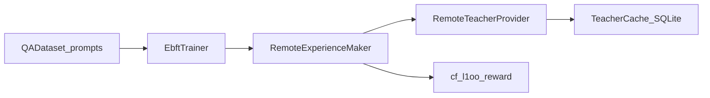

# docs/G2 说明文档计划

## 目标交付物（建议 5 个文件）

在 [`docs/G2/`](docs/G2/) 下新增：

| 文件 | 用途 |
|------|------|
| [`README.md`](docs/G2/README.md) | 入口：G2 是什么、读文档顺序、与仓库其他 `docs/` 的关系 |
| [`ENVIRONMENT_AND_DEPENDENCIES.md`](docs/G2/ENVIRONMENT_AND_DEPENDENCIES.md) | 运行环境、Python/conda、GPU/CUDA 注意点、依赖来源与安装方式 |
| [`PATHS_AND_CONFIGURATION.md`](docs/G2/PATHS_AND_CONFIGURATION.md) | **所有需在机器上改的路径**；各 shell 脚本顶部变量与 CLI 对应关系；输出目录与 teacher cache |
| [`G2_PHASE_SUMMARY.md`](docs/G2/G2_PHASE_SUMMARY.md) | G2 阶段工程上做了什么（远程教师、完整题目查询、目标混合、cf_l1oo）；关键代码文件与函数级索引 |
| [`SCRIPTS_CATALOG.md`](docs/G2/SCRIPTS_CATALOG.md) | 脚本分类：**正式训练 / 冒烟 / 单机开发 / 历史或异构环境** |

不写计划文件本身；不修改业务代码，仅新增文档（用户确认后再执行）。

---

## 环境与依赖（文档要点）

- **权威依赖声明**：指向本仓库根目录 [`requirements.txt`](requirements.txt)（含 `ray[default]==2.48.0`、`deepspeed`、`transformers` 等）。
- **与现有文档对齐**：说明 [`docs/ENVIRONMENT_SETUP.md`](docs/ENVIRONMENT_SETUP.md) 记录的是某次**已验证**运行时版本（其中部分绝对路径指向其他历史目录）；G2 文档明确写「以本仓库路径与当前脚本为准」，避免误跟旧路径。
- **G2 实际运行栈**：Ray + DeepSpeed + PyTorch + `datasets`；远程教师为 **HTTP OpenAI 兼容 API**，不依赖本机 vLLM（vLLM 仅作为服务端示例）。
- **虚拟环境**：说明项目常用 `.venv`，训练前需保证 `python -m openrlhf.cli.train_ebft_ray` 使用的解释器与 Ray worker 一致（与 smoke 脚本中 PATH 约定一致，见 [`scripts/run_g2_remote_teacher_smoke.sh`](scripts/run_g2_remote_teacher_smoke.sh) 若存在显式 `PATH` 则照实记录）。

---

## 路径与超参「在哪里改」（文档要点）

用表格集中说明：**变量名 → 含义 → 修改位置（脚本文件 + 区块标题）→ 映射到的 CLI 参数**。

必须写清的几类：

1. **模型与数据**
   - `MODEL_PATH`、`TRAIN_DATA` / `PROMPT_DATA`、`EVAL_DATA` / `EVAL_DATASET`
   - **HF 落盘两种形态**：单 `Dataset`（如 `aops_qa_hf/`）与 `DatasetDict`（如 `aops_qa_hf_dict/` + `train` 子目录）；与 [`openrlhf/trainer/ebft_trainer.py`](openrlhf/trainer/ebft_trainer.py) 中 `load_from_disk` 行为对应说明（文档中用文字概括，不贴大段代码）。

2. **远程教师**
   - `TEACHER_API_BASE`、`TEACHER_MODEL`、`TEACHER_API_KEY`、`TEACHER_API_STYLE`、`TEACHER_BACKEND`
   - 生成与稳健性：`TEACHER_TEMPERATURE`、`TEACHER_TOP_P`、`TEACHER_MAX_NEW_TOKENS`、`TEACHER_TIMEOUT`、`TEACHER_MAX_RETRIES`、`TEACHER_REMOTE_BATCH_SIZE`
   - 目标测度：`CF_TEACHER_LAMBDA`、`CF_TEACHER_N_SAMPLES` → CLI `--cf_teacher_lambda`、`--cf_teacher_n_samples`

3. **奖励与 CF**
   - `DISTRIBUTION_REWARD_TYPE=cf_l1oo`、`CF_TARGET_MODE=teacher`
   - `CF_NUM_FREQS`、`CF_SIGMA`、`CF_ALPHA`、`CF_BETA`、`CF_REWARD_SCALE` 等

4. **输出与 cache（明确写出）**
   - 生产脚本示例：[`scripts/run_g2_8gpu_remote_teacher.sh`](scripts/run_g2_8gpu_remote_teacher.sh) 中 `RUN_ROOT="${OUTPUT_ROOT}/${RUN_TAG}"`，`CACHE_DIR="${RUN_ROOT}/teacher_cache"`，并通过 `--teacher_cache_dir` 传入（与 [`openrlhf/cli/train_ebft_ray.py`](openrlhf/cli/train_ebft_ray.py) 中 `--teacher_cache_enable` / `--teacher_cache_dir` 一致）。
   - 说明：**每次新 run 因 `RUN_TAG` 带时间戳，cache 目录默认是新子目录**；若固定 `OUTPUT_ROOT` 且复用同名目录则需自行处理旧 cache。

5. **脚本间命名差异**
   - `run_train_qwen35_2b_aops_g2_remote_teacher.sh` 使用 `PROMPT_DATA`；`run_g2_8gpu_remote_teacher.sh` / `run_g2_baseline_8gpu_rerun.sh` 使用 `TRAIN_DATA` —— 文档中标注为同一类配置，仅变量名不同。

---

## G2 阶段「做了什么」（文档要点 + 可选示意图）

在 `G2_PHASE_SUMMARY.md` 中写清（与代码一致）：

- **目标测度**：\(\nu_c = (1-\lambda)\delta(\text{GT}) + \lambda \cdot \frac{1}{M}\sum_i \delta(\text{teacher}_i)\)，在特征空间通过 [`openrlhf/utils/embedding_utils.py`](openrlhf/utils/embedding_utils.py) 的 `_build_cf_target_embedding` 等与 `cf_target_mode=teacher` 路径结合。
- **远程教师输入**：按**完整题目**（来自 `QADataset` 的 `prompts` / `raw_question_texts`）请求 API，而非 8-token block 碎片；实现集中在 [`openrlhf/trainer/ppo_utils/ebft_experience_maker.py`](openrlhf/trainer/ppo_utils/ebft_experience_maker.py) 的 `_get_remote_teacher_samples` 与相关 helper。
- **API 与缓存**：[`openrlhf/utils/teacher_provider.py`](openrlhf/utils/teacher_provider.py)（`RemoteTeacherProvider`、`TeacherCache`、重试）。
- **训练入口**：[`openrlhf/cli/train_ebft_ray.py`](openrlhf/cli/train_ebft_ray.py)；编排：[`openrlhf/trainer/ebft_trainer.py`](openrlhf/trainer/ebft_trainer.py)（`teacher_provider`、`raw_question_texts` 传入 ExperienceMaker）。

可选 mermaid（保持节点 ID 无空格）：

---

## 脚本分类（`SCRIPTS_CATALOG.md`）

基于当前仓库实际文件：

| 类别 | 脚本 | 说明 |
|------|------|------|
| **推荐正式 8 卡 G2 + remote teacher** | [`scripts/run_g2_8gpu_remote_teacher.sh`](scripts/run_g2_8gpu_remote_teacher.sh) | 顶部集中 GPU、教师、目标测度、CF、数据、batch、输出；带 preflight 与可选 cache |
| **正式 8 卡 baseline 复跑** | [`scripts/run_g2_baseline_8gpu_rerun.sh`](scripts/run_g2_baseline_8gpu_rerun.sh) | 固定一套与论文/实验对齐的预算与超参；始终启用 `--teacher_cache_dir` |
| **正式训练（另一版，含更复杂 batch 自动约束）** | [`scripts/run_train_qwen35_2b_aops_g2_remote_teacher.sh`](scripts/run_train_qwen35_2b_aops_g2_remote_teacher.sh) | 长脚本，含 DeepSpeed/ED 双约束调整逻辑；适合需要自动对齐 batch 的场景 |
| **单机/少卡开发** | [`scripts/run_train_local_qwen35_2b_aops_remote_teacher.sh`](scripts/run_train_local_qwen35_2b_aops_remote_teacher.sh) | 默认可单 GPU |
| **冒烟** | [`scripts/run_g2_remote_teacher_smoke.sh`](scripts/run_g2_remote_teacher_smoke.sh) | 小预算、快速验证 remote teacher → target → reward 全链路；日志检查点写在脚本头注释 |
| **辅助（非训练主流程）** | [`scripts/test_teacher_provider.py`](scripts/test_teacher_provider.py)、[`scripts/mock_teacher_server.py`](scripts/mock_teacher_server.py) | API/cache 单测与本地假 teacher |
| **历史 / 异构环境（不推荐直接照抄）** | [`scripts/run_aops_g2_8gpu.sh`](scripts/run_aops_g2_8gpu.sh) | 硬编码 `REPO_ROOT=/mnt/workspace/...`、`Qwen2.5-1.5B`、无 remote teacher；用于旧 bundle 的 **cf_l1oo 纯分布** 跑法，与当前 G2 remote teacher 管线不同 |

文档中注明：**G1** 相关脚本（如 [`scripts/run_g1_baseline_8gpu_rerun.sh`](scripts/run_g1_baseline_8gpu_rerun.sh)）不属于 G2，仅在需要对比时引用。

---

## 实施步骤（确认后执行）

1. 创建目录 `docs/G2/`。
2. 按上表撰写 5 个 Markdown 文件；全文使用简体中文（与用户规则一致）。
3. 在 [`docs/G2/README.md`](docs/G2/README.md) 中加入指向 [`docs/STEP2_U1_CF_L1OO.md`](docs/STEP2_U1_CF_L1OO.md)、[`docs/STEP2D_TEACHER_TARGET_INTEGRATION.md`](docs/STEP2D_TEACHER_TARGET_INTEGRATION.md) 等的「延伸阅读」链接，避免与旧 STEP 文档重复堆砌公式。
4. **不自作主张修改** [`docs/ENVIRONMENT_SETUP.md`](docs/ENVIRONMENT_SETUP.md)（用户仅要求 `docs/G2`）；若需可在 G2 的 ENV 文档中加一句「建议未来把 ENVIRONMENT_SETUP 中的示例路径改为本仓库」作为可选维护项。
