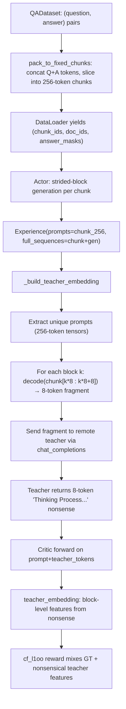
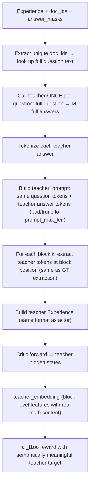

# Fix Remote Teacher: Full-Question Queries with Block-Aligned Features

## 1. Diagnosis Report

### 1.1 Current Pipeline Data Flow

### 1.2 Core Mismatch

**What works correctly (student side):**

- `QADataset` packs QA pairs into 256-token chunks. Each chunk may span 1 QA pair (AoPS answers are 500-1000 tokens, so one QA pair spans 3-5 chunks). This is fine for the block-level NTP training.
- Actor does strided-block generation (`stride=8, context=8, gen=8, 31 blocks per chunk`). This is by design.
- Critic extracts hidden-state features per block. Feature extraction and reward pipeline are correct.

**What is broken (teacher side):**

- `_get_remote_teacher_samples()` (line 695-706 in `ebft_experience_maker.py`) decodes each block's 8-token context window and sends it to the teacher as an independent prompt.
- The teacher receives fragments like `"Let the integers from $1$ to"` or `"Z}/(2n\\mathbb"` or even pure padding.
- With `chat_completions` style, qwen-122b interprets these as user messages and responds with `"Okay, the user wrote..."` or `"Thinking Process:\n\n1.  **"`.
- These nonsensical 8-token completions are tokenized, fed through the critic, and used as teacher_embedding. The resulting features have no mathematical semantics.

**Root cause:** The code was written assuming the teacher API works like a local strided-block generator (which generates tokens conditioned on the full model context). But a remote chat API has no access to the broader sequence — it only sees the 8-token fragment passed to it.

### 1.3 Concrete Evidence from Cache

- **7,975 cached entries**, all with `max_tokens=8`
- Top completions: `"Thinking Process:\n\n1.  **"` (268x), `"Here's a thinking process..."` (246x), `"Okay, let's see. The user"` (123x)
- These are chat-style responses to meaningless text fragments, not mathematical content

### 1.4 Data Structure Facts

- AoPS questions: 22-109 tokens. Answers: 500-1000 tokens.
- Each QA pair spans 3-5 packed chunks of 256 tokens.
- Many chunks contain ZERO question tokens (pure answer continuation).
- `QADataset.prompts` (list of raw question strings, indexed by doc_id) is already stored but **never passed** to the experience maker.
- `doc_ids` in each chunk maps each token position back to its originating QA pair index.

## 2. Minimal Viable Fix

### Design Principles

- Teacher sees the **complete question** and produces a **full mathematical answer**
- Teacher is called **once per unique question** (not once per block, not once per chunk)
- Teacher's answer is **tokenized and sliced into blocks** at the same positions as the GT, so the existing critic/feature/reward pipeline is unchanged
- Student block architecture, critic, feature map, cf_l1oo reward are **untouched**

### New Pipeline

### Block Alignment (Option A from user spec)

For block k at position `pos = k * stride + context_length` in the 256-token chunk:

- If `pos` is in the **question region** (answer_mask==0): block contains question tokens — same for GT and teacher, copy GT tokens
- If `pos` is in the **answer region** (answer_mask==1): use `teacher_answer_tokens[pos - answer_start]` (truncated/padded to match)

This is the most natural alignment: teacher and GT share the same question prefix, teacher's answer occupies the same structural slot.

## 3. Files to Modify

### 3.1 `openrlhf/datasets/qa_dataset.py` — Minor

- Expose a `get_question_by_doc_id(doc_id) -> str` method (or just use existing `self.prompts[doc_id]`)

### 3.2 `openrlhf/trainer/ebft_trainer.py` — Small (5 lines)

- After creating `prompts_dataset`, extract `prompts_dataset.prompts` (raw question strings list)
- Pass it to `RemoteExperienceMaker` as `raw_question_texts=...`

### 3.3 `openrlhf/trainer/ppo_utils/ebft_experience_maker.py` — Main change

- `RemoteExperienceMaker.__init_`_: accept and store `raw_question_texts`
- **Rewrite** `_get_remote_teacher_samples()`:
  - Extract unique doc_ids from each chunk's `doc_ids` tensor
  - Look up full question text via `self.raw_question_texts[doc_id]`
  - Deduplicate: one teacher call per unique question (across all chunks in batch)
  - Call teacher with full question, get M answers with generous `max_new_tokens`
  - Tokenize each teacher answer
  - For each chunk, reconstruct a "teacher prompt" by replacing answer tokens with teacher answer tokens (using `answer_mask` to identify answer positions)
  - Build block-interleaved `full_sequences` from teacher prompt (same interleaving logic as before)
  - Return list of `Experience` objects (same format, same shape)
- `_build_teacher_embedding()`: pass `unique_qa_masks` through to `_get_remote_teacher_samples` (already available)

### 3.4 Scripts — Config update

- `run_g2_baseline_8gpu_rerun.sh` and `run_g2_remote_teacher_smoke.sh`:
  - Add/set `--teacher_max_new_tokens 512` (or similar, instead of defaulting to `generate_max_len=8`)

### 3.5 `openrlhf/cli/train_ebft_ray.py` — Trivial

- Ensure `--teacher_max_new_tokens` default is reasonable (e.g., 512) when `teacher_backend=remote`

## 4. What Stays Unchanged

- `openrlhf/utils/embedding_utils.py` — no changes (cf_l1oo, _build_cf_target_embedding)
- `openrlhf/utils/teacher_provider.py` — no changes (already handles full-text prompts)
- Critic model, feature map, reward computation — no changes
- Actor training loop, advantage estimation — no changes
- QADataset packing logic — no changes

## 5. Smoke Test Verification

After the fix, running `scripts/run_g2_remote_teacher_smoke.sh` should show:

- Teacher receives: `"Let the integers from $1$ to $2n$ be partitioned into two groups..."` (full question, 50-100+ tokens)
- Teacher returns: a proper mathematical proof/solution (100-500 tokens)
- Log: `[Teacher-Remote] Requesting P unique questions x M=2 samples ...` (NOT `P*K block contexts`)
- `[TEACHER-TARGET] MIXED target built ...` with meaningful feature means
- `teacher_in_reward = True`

