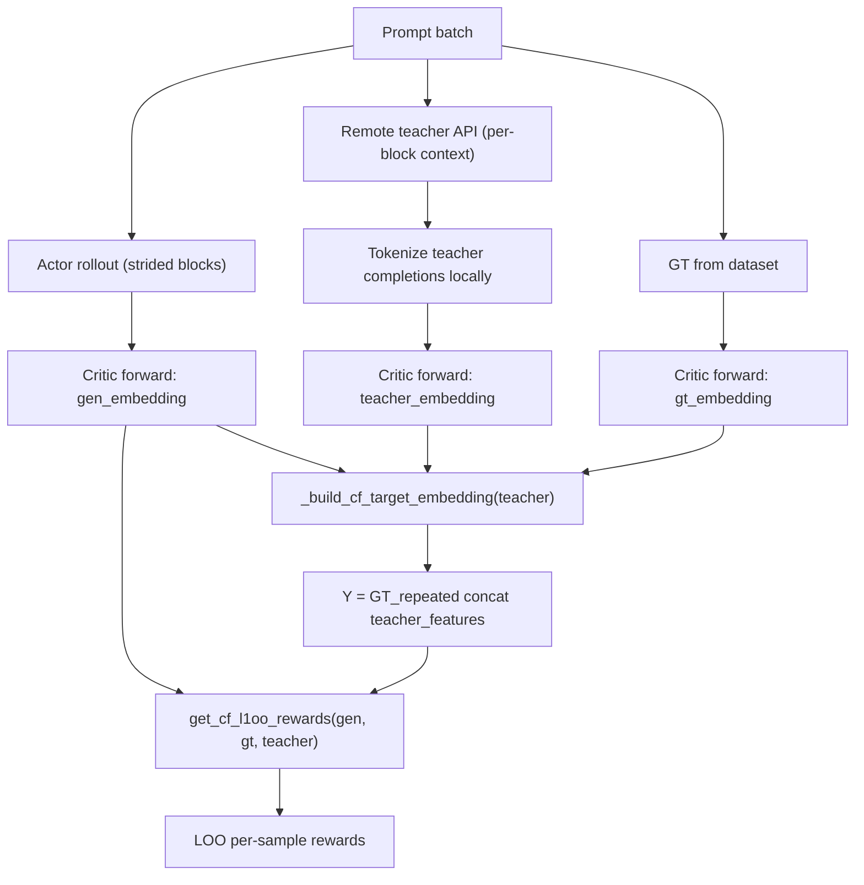

# G2 Remote Teacher-Augmented Target Measure

## Current Code Situation

The **mounted** copy at `/mnt/data/Distributional-Match-Tuning` already has a **complete, tested** remote teacher implementation. The **working** copy at `/root/code/data/Distributional-Match-Tuning` is behind by exactly this feature. Here is what exists vs what is missing:

### Already implemented (in `/mnt/data/` only, NOT in working copy)

- `**openrlhf/utils/teacher_provider.py`** (379 lines) -- `RemoteTeacherProvider` with OpenAI-compatible HTTP client, SQLite cache, retry logic, concurrent batch requests, factory `build_teacher_provider(args)`
- `**openrlhf/cli/train_ebft_ray.py`** -- CLI args: `--teacher_backend`, `--teacher_api_base`, `--teacher_api_key`, `--teacher_api_style`, `--teacher_model_name`, `--teacher_timeout`, `--teacher_max_retries`, `--teacher_remote_batch_size`, `--teacher_temperature`, `--teacher_top_p`, `--teacher_max_new_tokens`, `--teacher_cache_enable`, `--teacher_cache_dir`; plus `teacher_backend=remote` gate to skip local teacher model
- `**openrlhf/trainer/ebft_trainer.py**` -- builds `teacher_provider` via factory, passes it to `RemoteExperienceMaker`
- `**openrlhf/trainer/ppo_utils/ebft_experience_maker.py**` -- `_get_remote_teacher_samples()` method that calls provider per-block-context, `_build_teacher_embedding()` supporting both local and remote backends, gate logic in `make_experience()` accepting `teacher_provider`
- `**openrlhf/utils/embedding_utils.py**` -- improved logging, `r = max(min(r, max_r), 1)` safety fix, effective_lambda reporting
- `**scripts/test_teacher_provider.py**` + `**scripts/mock_teacher_server.py**` -- standalone smoke tests for the provider

### Already implemented (in BOTH copies)

- `**cf_l1oo` reward** in `embedding_utils.py`: `get_cf_l1oo_rewards()` with leave-one-out marginal contribution
- `**_build_cf_target_embedding()`**: constructs target empirical measure for `single`/`vicinal`/`teacher` modes using GT replication + teacher features concatenation (unweighted set approximation of weighted mixture)
- `**cf_target_mode=teacher`** CLI choice, `cf_teacher_lambda`, `cf_teacher_n_samples`
- **Training script** `scripts/run_train_local_qwen35_2b_aops_remote_teacher.sh` with all remote teacher env vars

### What is NOT needed (already verified)

- No new reward math -- the existing `cf_l1oo` + leave-one-out + `_build_cf_target_embedding(teacher)` path handles the target measure exactly as specified: `Y = {gt_feature} U {teacher_features}` with lambda-weighted replication
- No new embedding logic -- teacher completions go through the same critic forward + embed + feature_map pipeline as actor/GT
- No weighted empirical measure code change -- the unweighted set approximation via GT replication is already in place with clear comments

## Implementation Plan

### Step 1: Sync remote teacher code from `/mnt/data/` to working copy

Copy these files from `/mnt/data/Distributional-Match-Tuning/` to `/root/code/data/Distributional-Match-Tuning/`:

- **New file**: `openrlhf/utils/teacher_provider.py` (copy verbatim)
- **New file**: `scripts/test_teacher_provider.py` (copy verbatim)
- **New file**: `scripts/mock_teacher_server.py` (copy verbatim)
- **Patch**: `openrlhf/cli/train_ebft_ray.py` -- add remote teacher CLI args + backend gate
- **Patch**: `openrlhf/trainer/ebft_trainer.py` -- add teacher_provider construction + wiring
- **Patch**: `openrlhf/trainer/ppo_utils/ebft_experience_maker.py` -- add `_get_remote_teacher_samples()`, `teacher_provider` field, remote path in `_build_teacher_embedding()`, gate in `make_experience()`
- **Patch**: `openrlhf/utils/embedding_utils.py` -- improved logging + safety fix

For the patched files, the working copy has recent eval-audit edits (from earlier in this conversation) that must be preserved. The safest approach: apply the `/mnt/data/` version as base, then re-apply the eval-audit fixes on top.

### Step 2: Create G2 remote teacher training script

Create `scripts/run_train_qwen35_2b_aops_g2_remote_teacher.sh` based on the existing `run_train_local_qwen35_2b_aops_remote_teacher.sh` with these key settings:

- `--distribution_reward_type cf_l1oo`
- `--cf_target_mode teacher`
- `--teacher_backend remote`
- `--cf_teacher_lambda 0.5` (default, overridable)
- `--cf_teacher_n_samples 2` (default, overridable)
- Full env-var configurability for teacher API endpoint, model paths, data paths
- Production batch/episode/sample sizes for 8-GPU training

### Step 3: Create smoke test script

Create `scripts/run_g2_remote_teacher_smoke.sh`:

- 1 episode, 1 epoch, `max_samples=4`, tiny batches
- Same remote teacher config (overridable)
- Explicit logging verification expectations in comments

### Key data flow (no changes needed)

## Files to modify/create

- **Copy**: `openrlhf/utils/teacher_provider.py` (new)
- **Copy**: `scripts/test_teacher_provider.py` (new)
- **Copy**: `scripts/mock_teacher_server.py` (new)
- **Patch**: `openrlhf/cli/train_ebft_ray.py`
- **Patch**: `openrlhf/trainer/ebft_trainer.py`
- **Patch**: `openrlhf/trainer/ppo_utils/ebft_experience_maker.py`
- **Patch**: `openrlhf/utils/embedding_utils.py`
- **Create**: `scripts/run_train_qwen35_2b_aops_g2_remote_teacher.sh`
- **Create**: `scripts/run_g2_remote_teacher_smoke.sh`

