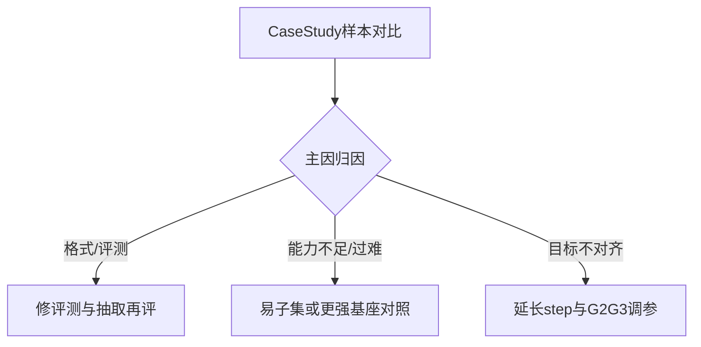

# N2 实验后的下一步建议

文档结论要点：在统一 **step=500**、**Qwen3.5-2B-Base**、**AoPS actor-only** 设置下，G1/G2/G3 相对 Base 几乎无增益，SFT 明显变差；文档判断这更像 **任务难度 / 模型能力 / 训练目标与 final-answer 对齐** 的综合错配，而非仅 G2/G3 未调参。

## 文档已写明的第一优先项

文末 [N2 32d814b07691803dbb39d1f632e2e892.md](N2%2032d814b07691803dbb39d1f632e2e892.md) 第 4.2 节与结尾已约定：

- **Case Study（GPU 空闲后启动）**：抽取少量代表性 AoPS 样例，对比 Base / G1 / G2 / G3 / SFT 的输出，并按文档列出的五类归因（不会做、推导中断、计算错、格式导致判错、微调退化）。
- **目的**：区分问题是 **能力不足**、**训练目标未转化为答题**、还是 **评测/抽取/格式** 导致的假阴性。

这是当前最该做的「下一步」，因为 aggregate accuracy 无法单独回答文档 4.1 里列出的多种假说。

## 与 Case Study 并行或紧接的核查项

- **评测协议与答案抽取**：文档已提到「后续修正评测协议以排除实现偏差」——应在 Case Study 时同步核对：final-answer 提取规则、是否与参考答案规范化一致、是否大量「其实接近但被格式判错」。
- **Step 500 是否过早**：文档列为可能原因之一；若 Case Study 显示模型已在学推理但答案仍错，可规划 **更长 budget 或关键 step 曲线**（不必立刻上大实验，可先小规模验证趋势）。

## 若 Case Study 指向「基座过弱 / 任务过难」

- **缩小问题**：在较易子集或更短题上复现 G1/SFT，验证「微调能否带来正向信号」。
- **对齐 AoPS 论文设定（概念上）**：文档指出 AoPS 相关工作多用 **更强 instruct/math 模型** 与 **更大训练预算**——若资源允许，用 **指令化或数学向 7B 级** 做一条对照，避免在 2B-Base 上过早否定方法。

## 若 Case Study 指向「目标与 final-answer 不对齐」

- 再系统调 G2/G3 的工程细节（超参、reward 尺度、特征空间稳定性等），并明确与 G1 的 **ablation** 设计，避免与「基座/任务」问题混在同一结论里。

## 建议的执行顺序（简图）

**一句话**：文档里写好的下一步就是 **等资源做 Case Study + 同步收紧评测可信度**；根据归因再分叉到「改评测」「换/弱任务验证管线」或「加长训练与调 distributional 细节」。

