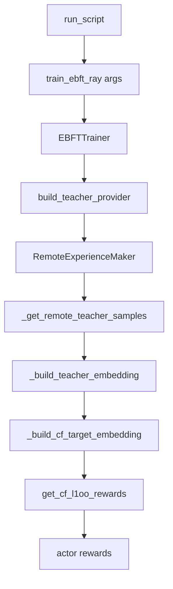

# Remote Teacher Target Checklist

## Current Finding

The current script [`scripts/run_g2_baseline_8gpu_rerun.sh`] is not actually using the remote teacher target distribution, because it sets `DISTRIBUTION_REWARD_TYPE="pointwise"`. In [`openrlhf/trainer/ppo_utils/ebft_experience_maker.py`], the teacher branch is only entered when all of the following are true:

```1169:1184:openrlhf/trainer/ppo_utils/ebft_experience_maker.py
logger.info(
    "[TEACHER-VERIFY] Teacher branch gate: "
    ...
    'ENTER teacher branch' if (_dr_type == 'cf_l1oo' and _ct_mode == 'teacher' and _has_teacher) else 'SKIP teacher branch',
)
if (
    _dr_type == "cf_l1oo"
    and _ct_mode == "teacher"
    and _has_teacher
):
    teacher_embedding = self._build_teacher_embedding(...)
```

So `pointwise + teacher` is insufficient.

## Must-Have Conditions

To truly consume a remote teacher target distribution, verify all of the following:

- In the run script, set `DISTRIBUTION_REWARD_TYPE="cf_l1oo"`.
- In the run script, set `CF_TARGET_MODE="teacher"`.
- In the run script, set `TEACHER_BACKEND="remote"` and provide:
  - `TEACHER_API_BASE`
  - `TEACHER_API_KEY`
  - `TEACHER_MODEL`
  - `CF_TEACHER_LAMBDA`
  - `CF_TEACHER_N_SAMPLES`
- Ensure CLI wiring exists in [`openrlhf/cli/train_ebft_ray.py`] for `teacher_backend`, `teacher_api_base`, `teacher_model_name`, `cf_teacher_lambda`, `cf_teacher_n_samples`.
- Ensure trainer wiring exists in [`openrlhf/trainer/ebft_trainer.py`] so `build_teacher_provider(args)` is called and passed into `RemoteExperienceMaker`.

## Runtime Data Flow To Confirm

The intended remote-teacher flow is:




Key checkpoints in code:

- [`openrlhf/trainer/ebft_trainer.py`] builds and wires `teacher_provider`.
- [`openrlhf/trainer/ppo_utils/ebft_experience_maker.py`] calls `teacher_provider.sample_targets(...)` inside `_get_remote_teacher_samples(...)`.
- [`openrlhf/utils/embedding_utils.py`] mixes GT and remote-teacher embeddings into the target empirical measure:

```215:283:openrlhf/utils/embedding_utils.py
def _build_cf_target_embedding(..., teacher_embedding: torch.Tensor = None, cf_teacher_lambda: float = 0.0):
    ...
    if cf_target_mode == "teacher":
        ...
        mixed = torch.cat([gt_repeated, teacher_float], dim=2)
        _embedding_logger.info(
            f"[TEACHER-TARGET] MIXED target built: "
            f"lambda={lam}, r_gt={r}, m_teacher={m}, ..."
        )
        return mixed
```

## Log-Based Verification Checklist

After switching the script to `cf_l1oo + teacher + remote`, confirm these log lines appear during training:

- `[TEACHER-VERIFY] teacher_backend=remote`
- `[TEACHER-VERIFY] Teacher branch gate ... => ENTER teacher branch`
- `[Teacher-Remote] Requesting ... from DLC remote teacher`
- `[Teacher-Remote] ✓ Completions received from remote DLC teacher`
- `[TEACHER-VERIFY] teacher_embedding built: backend=remote`
- `[TEACHER-TARGET] MIXED target built:`
- `[TEACHER-DIAG] ... teacher_in_reward = True`

If you instead see either of the following, the remote teacher is not truly being used in reward construction:

- `SKIP teacher branch`
- `teacher_in_reward = False`

## Suggested Validation Order

- First validate the script config: `distribution_reward_type`, `cf_target_mode`, and remote teacher env vars.
- Then run a tiny smoke test using [`scripts/run_g2_remote_teacher_smoke.sh`] or a reduced variant of the G2 baseline.
- Inspect logs for the exact teacher-branch and target-mixing messages above.
- Only after that run the full 8-GPU baseline/rerun job.

## Important Caveat

If you keep `distribution_reward_type="pointwise"`, the actor will still talk only to GT embeddings in reward computation, even if remote teacher config is present. In that case, the remote teacher setup is effectively dead configuration for target-distribution construction.