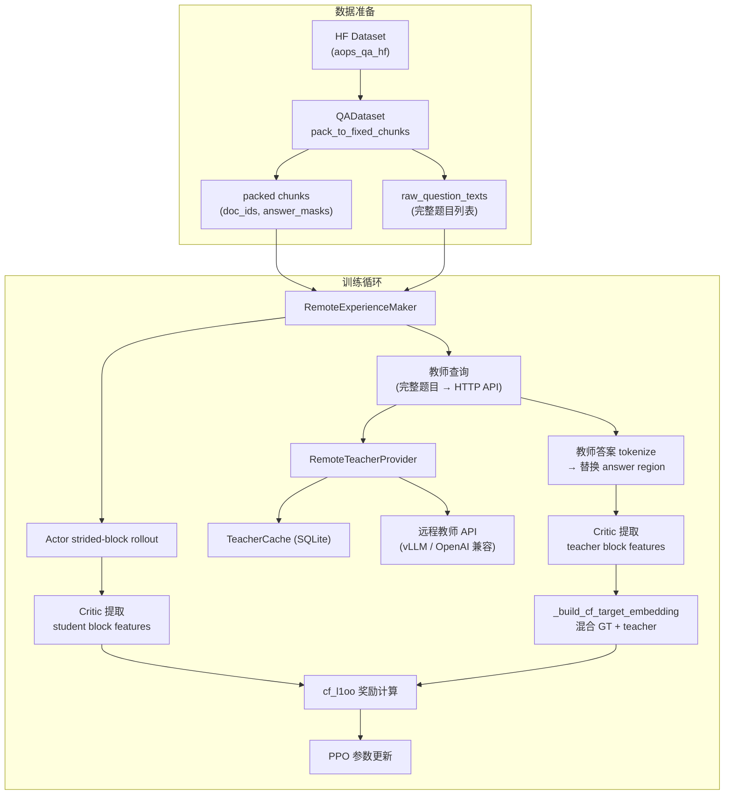

# G2 阶段总结

## 1. G2 是什么

G2 是本项目 Distributional Match Tuning 的第二阶段，核心目标是引入**外部远程教师模型**来增强目标测度（target measure），使 student 模型的训练信号从「仅匹配单点 ground-truth」升级为「匹配由 GT 与教师多样本混合而成的分布」。

与前序阶段的关系：

- **G1**（baseline）：使用 `cf_l1oo` 分布奖励，但目标测度仅包含 ground-truth 单点（`cf_target_mode=single`）。
- **G2**（本阶段）：目标测度扩展为 GT + 远程教师混合（`cf_target_mode=teacher`），教师通过 HTTP API 提供完整数学题的 M 条独立解答。
- **G3**（未来）：可能进一步引入 feature adapter、EMA target geometry 等。

## 2. 目标测度

对于每个 packed chunk c，目标测度定义为：

```
nu_c = (1 - lambda) * delta(phi(c, y_gt)) + lambda * (1/M) * sum_{i=1}^{M} delta(phi(c, y_i^T))
```

其中：
- `phi(c, y)` 是 critic/feature network 对 chunk c 在答案 y 下提取的特征向量
- `y_gt` 是 ground-truth 答案
- `y_i^T` 是远程教师的第 i 条独立完成（completion）
- `lambda` 控制 GT 与教师的混合比（`--cf_teacher_lambda`，默认 0.5）
- `M` 是教师采样数（`--cf_teacher_n_samples`，默认 2）

奖励信号通过 **cf_l1oo**（characteristic function leave-one-out）计算：每个 student rollout sample 的奖励等于将其从集合中移除后整体分布匹配度的变化量（即边际贡献）。

## 3. 关键设计：教师看完整题目

EBFT 训练中 student 采用 **strided-block** 架构：QA 对被 tokenize 后拼接并切分为固定长度（如 8 token）的 block，逐 block 生成。这一设计对 student 训练是合理的。

但远程教师不应只看到 block-level 的文本碎片——一个 8-token 片段（如 `"Let the integers from $1$ to"`）对通用 LLM 来说没有语义，只会被当成对话续写。

G2 的核心工程改造：

1. **教师接收完整数学题**：从 `QADataset.prompts`（按 `doc_id` 索引的原始问题文本列表）中提取每道题的完整文本。
2. **每题只请求一次**：同一 batch 中多个 block 若来自同一道题（同一 `doc_id`），只向教师请求一次。
3. **答案重建到 block 结构**：教师返回的完整答案被 tokenize 后，替换 packed chunk 中的 answer region token，生成与 student block 对齐的 teacher prompt。
4. **特征空间匹配**：critic/feature network 在这些 teacher prompt 上提取 block-level 特征，与 GT 特征混合构成目标测度。

## 4. 数据流



## 5. 关键代码文件索引

### 训练入口与编排

| 文件 | 关键类/函数 | 职责 |
|------|-----------|------|
| `openrlhf/cli/train_ebft_ray.py` | CLI 参数定义 | 定义所有 `--teacher_*`、`--cf_*` 参数；当 `teacher_backend=remote` 时跳过本地教师模型创建 |
| `openrlhf/trainer/ebft_trainer.py` | `EbftTrainer` | 构建 `teacher_provider`；从 `QADataset` 获取 `raw_question_texts` 并传入 `RemoteExperienceMaker` |

### 经验生成与教师采样

| 文件 | 关键类/函数 | 职责 |
|------|-----------|------|
| `openrlhf/trainer/ppo_utils/ebft_experience_maker.py` | `RemoteExperienceMaker` | 整体经验生成：actor rollout、教师采样、特征提取 |
| 同上 | `_get_remote_teacher_samples()` | 按 `doc_id` 去重提取完整题目→调用 `teacher_provider.sample_targets()`→tokenize 教师答案→替换 answer region→构建 block 对齐的 teacher Experience |
| 同上 | `_build_teacher_prompt()` | 将教师答案 token 写入 packed chunk 的 answer 区域 |
| 同上 | `_build_teacher_embedding()` | 用 critic 在 teacher prompt 上提取特征 |

### 远程教师 API 与缓存

| 文件 | 关键类/函数 | 职责 |
|------|-----------|------|
| `openrlhf/utils/teacher_provider.py` | `RemoteTeacherProvider` | HTTP 客户端：支持 `completions` 和 `chat_completions` 两种 API 风格，带重试和并发控制 |
| 同上 | `TeacherCache` | SQLite 磁盘缓存，key 为 (prompt, model, 生成参数) |
| 同上 | `build_teacher_provider()` | 工厂函数：根据 CLI args 构建 provider 实例（含可选 cache） |

### 分布奖励计算

| 文件 | 关键类/函数 | 职责 |
|------|-----------|------|
| `openrlhf/utils/embedding_utils.py` | `_build_cf_target_embedding()` | 当 `cf_target_mode=teacher` 时，将 GT embedding 与 teacher embedding 按 `cf_teacher_lambda` 混合 |
| 同上 | `compute_cf_l1oo_reward()` | 计算 leave-one-out 边际贡献奖励 |

### 数据集

| 文件 | 关键类/函数 | 职责 |
|------|-----------|------|
| `openrlhf/datasets/qa_dataset.py` | `QADataset` | tokenize + pack QA 对为固定长度 chunks；`self.prompts` 保存原始问题文本列表 |
| 同上 | `pack_to_fixed_chunks()` | 实际执行拼接切块；生成 `doc_ids` 和 `answer_masks` 张量 |

## 6. G2 阶段引入或修改的代码变更汇总

| 变更类型 | 文件 | 概述 |
|---------|------|------|
| **新增** | `openrlhf/utils/teacher_provider.py` | 远程教师 HTTP 客户端 + SQLite 缓存 |
| **新增** | `scripts/run_g2_8gpu_remote_teacher.sh` | 推荐的 8 卡正式训练脚本 |
| **新增** | `scripts/run_g2_remote_teacher_smoke.sh` | 冒烟测试脚本 |
| **新增** | `scripts/run_g2_baseline_8gpu_rerun.sh` | baseline 复跑脚本 |
| **新增** | `scripts/test_teacher_provider.py` | teacher_provider 单元测试 |
| **新增** | `scripts/mock_teacher_server.py` | 本地假教师服务（测试用） |
| **改造** | `ebft_experience_maker.py` | 重写 `_get_remote_teacher_samples`：完整题目查询 + block 对齐 |
| **改造** | `ebft_trainer.py` | 构建 `teacher_provider`，传入 `raw_question_texts` |
| **改造** | `train_ebft_ray.py` | 新增全套 `--teacher_*` CLI 参数 |
| **改造** | `embedding_utils.py` | `_build_cf_target_embedding` 支持 `teacher` 模式 |
| **修复** | `ebft_trainer.py` | `prepare_datasets()` 兼容 `Dataset` 和 `DatasetDict` 两种格式 |
| **修复** | `ebft_eval_mixin.py` | 答案解析包裹 `\boxed{}` |
| **修复** | `ebft_trainer.py` / `sft_trainer.py` | eval routing 加入 `"aops"` |
